**COMPUTER VISION - LAB1**

**1)**  **What is the**  **grep**  **command?**

Grep processes text line by line and prints which match with a certain pattern.

The general expression to use it is:

grep [_OPTIONS_] _PATTERN_ [_FILE_...]

For instance,  If you want to search the phrase &quot;Hola Mundo&quot; in a file whose name is prueba.txt you have to write:

grep &quot;Hola Mundo&quot; prueba.txt

This command will return to you the lines where is the pattern.

Grep has several options, such as:  color what highlights the pattern in each line, n, that will prefix  each matching line with its respective line number. There are other several commands in the documentation.

**2)**  **What is the meaning of**  **#! /bin/bash**  **at the start of scripts?**

This line indicates which program must interpret the script. this sequence of characters is called **shebang**

** **

**3) How many users exist in the course server?**

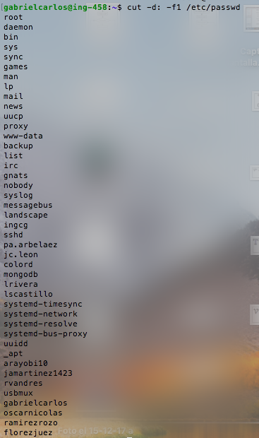

To count the numbers of users in the server we can use:

cut -d: -f1 /etc/passwd

In the case of the course server we have the next users:

To count the number of lines returned in the command we can use:

wc -l

In this way the command final command returns:

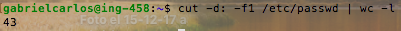

**4:**  **What command will produce a table of Users and Shells sorted by Shell****?**

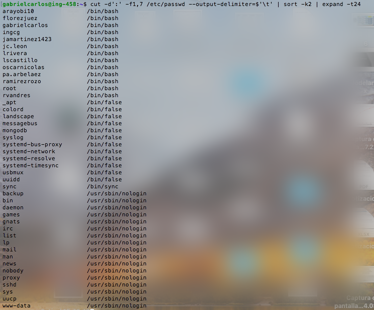

The command used was compposed of several parts:

Cut: This command is used to process text.

Sort: Sorts text according to some column, in this case the second one.

Expand: With this command we can give some format to the output.

**5:** **Create a script for finding duplicate images based on their content (tip: hash or checksum) You may look in the internet for ideas, Do not forget to include the source of any code you use.**

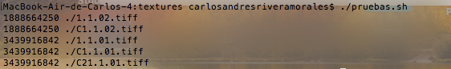

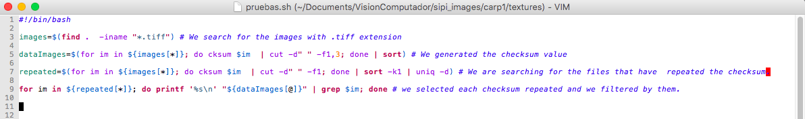

#!/bin/bash

images=$(find .  -iname &quot;\*.tiff&quot;) # We search for the images with .tiff extension

dataImages=$(for im in ${images[\*]}; do cksum $im  | cut -d&quot; &quot; -f1,3; done | sort) # We generated the checksum value

repeated=$(for im in ${images[\*]}; do cksum $im  | cut -d&quot; &quot; -f1; done | sort -k1 | uniq -d) # We are searching for the files that have  repeated the checksum

for im in ${repeated[\*]}; do printf &#39;%s\n&#39; &quot;${dataImages[@]}&quot; | grep $im; done # we selected each checksum repeated and we filtered by them.

**6) Download the** [**bsds500**](https://www2.eecs.berkeley.edu/Research/Projects/CS/vision/grouping/resources.html#bsds500) **image segmentation database and decompress it (keep it in you hard drive, we will come back over this data in a few weeks).**

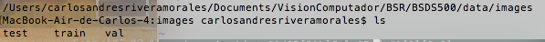

The files were downloaded from:

https://www2.eecs.berkeley.edu/Research/Projects/CS/vision/grouping/resources.html#bsds500

**7)**  **What is the disk size of the uncompressed dataset, How many images are in the directory &#39;BSR/BSDS500/data/images&#39;?**

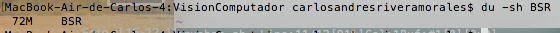

The size of the directory is 72M.

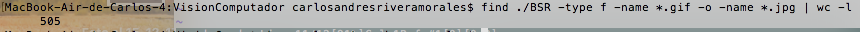

The number of images in the folder are 505.

**8)**  **What is their resolution, what is their format?**

Using  imageMagick we can

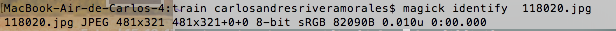

 Their format is JPEG and ther resolution is 481x321 or 321x481 depending if the image is in landscape or portrait.

** 9)**  **How many of them are in**  **landscape** **orientation (opposed to**  **portrait**** )?**

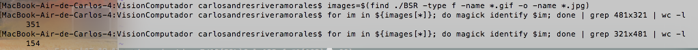

Using image Magick we can know the size of each image, with find we can detect each .jpg image, .

Using this we determined that there are 351 landscape and 154 portrait images.

**10)** **Crop all images to make them square (256x256). Tip: do not forget about** [**imagemagick**](http://www.imagemagick.org/script/index.php) **.**

To crop all images to (256x256) we first select using find all images in the directory BSR, afterwords using imageMagick with the command convert -crop we cropped them all.

Here, you can see the commands used.

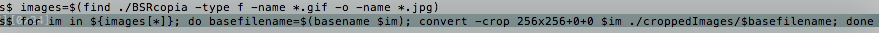

 images=$(find ./BSRcopia -type f -name \*.gif -o -name \*.jpg) #here we select all images

for im in ${images[\*]}; do basefilename=$(basename $im); convert -crop 256x256+0+0 $im ./croppedImages/$basefilename; done  #Here we cropped the selected images.

In the next image we can observe that the size of each image is 256x256.

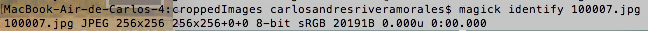

References

[https://www.thegeekstuff.com/2013/06/cut-command-examples/](https://www.thegeekstuff.com/2013/06/cut-command-examples/)

[https://www.tecmint.com/sort-command-linux/](https://www.tecmint.com/sort-command-linux/)

https://www.computerhope.com/unix/ucksum.htm

[https://www.imagemagick.org/script/identify.php](https://www.imagemagick.org/script/identify.php)

[https://stackoverflow.com/questions/10124314/grab-the-filename-in-unix-out-of-full-path](https://stackoverflow.com/questions/10124314/grab-the-filename-in-unix-out-of-full-path)

[https://www.imagemagick.org/discourse-server/viewtopic.php?t=17339](https://www.imagemagick.org/discourse-server/viewtopic.php?t=17339)
